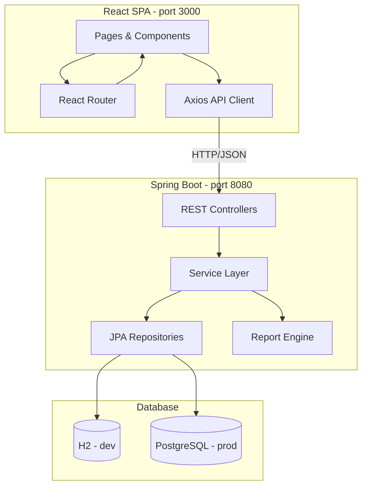
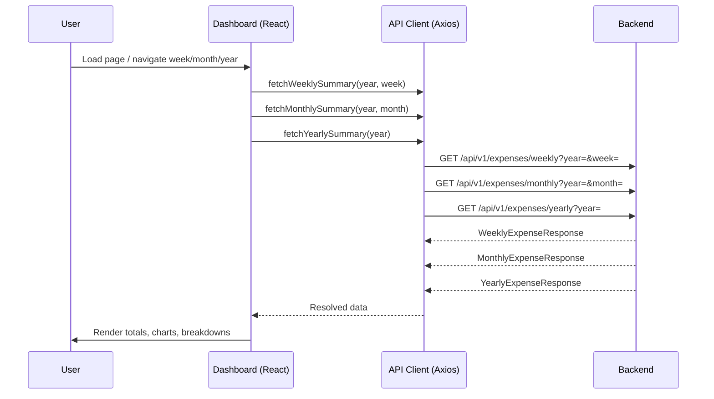

# Design Document — Expense Tracker

## Overview

The Expense Tracker is a full-stack web application with a Java Spring Boot 4.0.6 backend (package `com.project.kiro`) and a React JS frontend. Users can record, edit, and delete personal expenses; browse them by week, month, or year; visualize spending trends on a dashboard; compare periods side-by-side; and download reports in CSV or PDF format.

The backend exposes a RESTful JSON API consumed by the React SPA. Persistence is handled by Spring Data JPA backed by H2 (development) and PostgreSQL (production). Report generation uses Apache POI for CSV and iText for PDF.

---

## Architecture



**Key design decisions:**

- The React SPA is served separately (Vite dev server in development, Nginx in production) and communicates with the backend via CORS-enabled REST endpoints.
- Spring Boot handles all business logic, validation, and persistence. No server-side rendering.
- H2 in-memory database is used for local development and tests; PostgreSQL is the production target.
- Report generation is synchronous for the initial version — large reports are bounded by the 1000-record cap on expense lists.

---

## Backend Package Structure

```
com.project.kiro
├── KiroApplication.java
├── config/
│   ├── CorsConfig.java
│   ├── DataInitializer.java          # seeds default categories on startup
│   └── JacksonConfig.java            # BigDecimal serialization, date formats
├── controller/
│   ├── ExpenseController.java
│   ├── CategoryController.java
│   └── ReportController.java
├── service/
│   ├── ExpenseService.java
│   ├── CategoryService.java
│   ├── ReportService.java
│   └── ComparisonService.java
├── repository/
│   ├── ExpenseRepository.java
│   └── CategoryRepository.java
├── model/
│   ├── Expense.java                  # JPA entity
│   └── Category.java                 # JPA entity
├── dto/
│   ├── request/
│   │   ├── ExpenseRequest.java
│   │   ├── CategoryRequest.java
│   │   └── ReportRequest.java
│   └── response/
│       ├── ExpenseResponse.java
│       ├── WeeklyExpenseResponse.java
│       ├── MonthlyExpenseResponse.java
│       ├── CategoryResponse.java
│       ├── ComparisonResponse.java
│       ├── YearlyComparisonResponse.java
│       └── ReportResponse.java
├── exception/
│   ├── ResourceNotFoundException.java
│   ├── CategoryInUseException.java
│   ├── DuplicateCategoryException.java
│   └── GlobalExceptionHandler.java
└── report/
    ├── CsvReportGenerator.java
    └── PdfReportGenerator.java
```

---

## Data Models

### JPA Entity: `Category`

```java
@Entity
@Table(name = "categories",
       uniqueConstraints = @UniqueConstraint(columnNames = "name_lower"))
@Data @NoArgsConstructor @AllArgsConstructor @Builder
public class Category {

    @Id
    @GeneratedValue(strategy = GenerationType.IDENTITY)
    private Long id;

    @Column(nullable = false, length = 100)
    private String name;

    // Stored lowercase for case-insensitive uniqueness enforcement
    @Column(name = "name_lower", nullable = false, length = 100)
    private String nameLower;

    @OneToMany(mappedBy = "category", fetch = FetchType.LAZY)
    private List<Expense> expenses;
}
```

### JPA Entity: `Expense`

```java
@Entity
@Table(name = "expenses",
       indexes = {
           @Index(name = "idx_expense_date", columnList = "expense_date"),
           @Index(name = "idx_expense_category", columnList = "category_id")
       })
@Data @NoArgsConstructor @AllArgsConstructor @Builder
public class Expense {

    @Id
    @GeneratedValue(strategy = GenerationType.IDENTITY)
    private Long id;

    @Column(nullable = false, precision = 12, scale = 2)
    private BigDecimal amount;

    @Column(name = "expense_date", nullable = false)
    private LocalDate expenseDate;

    @ManyToOne(fetch = FetchType.EAGER, optional = false)
    @JoinColumn(name = "category_id", nullable = false)
    private Category category;

    @Column(length = 255)
    private String description;
}
```

### Database Schema (SQL)

```sql
CREATE TABLE categories (
    id         BIGSERIAL PRIMARY KEY,
    name       VARCHAR(100) NOT NULL,
    name_lower VARCHAR(100) NOT NULL,
    CONSTRAINT uq_category_name_lower UNIQUE (name_lower)
);

CREATE TABLE expenses (
    id           BIGSERIAL PRIMARY KEY,
    amount       NUMERIC(12, 2) NOT NULL,
    expense_date DATE           NOT NULL,
    category_id  BIGINT         NOT NULL REFERENCES categories(id),
    description  VARCHAR(255),
    CONSTRAINT chk_amount_positive CHECK (amount > 0)
);

CREATE INDEX idx_expense_date     ON expenses (expense_date DESC);
CREATE INDEX idx_expense_category ON expenses (category_id);
```

---

## Components and Interfaces

### REST API Design

All endpoints are prefixed with `/api/v1`. Dates use ISO-8601 format (`YYYY-MM-DD`). Monetary amounts are JSON numbers with up to 2 decimal places.

#### Expense Endpoints (`ExpenseController`)

| Method | Path | Description |
|--------|------|-------------|
| `POST` | `/api/v1/expenses` | Create a new expense |
| `GET` | `/api/v1/expenses` | List all expenses (sorted by date desc, max 1000) |
| `GET` | `/api/v1/expenses/{id}` | Get a single expense by ID |
| `PUT` | `/api/v1/expenses/{id}` | Update an existing expense |
| `DELETE` | `/api/v1/expenses/{id}` | Delete an expense |
| `GET` | `/api/v1/expenses/weekly?year={y}&week={w}` | Weekly expense view |
| `GET` | `/api/v1/expenses/monthly?year={y}&month={m}` | Monthly expense view |
| `GET` | `/api/v1/expenses/comparison/monthly?year={y}&month={m}` | Month-over-month comparison |
| `GET` | `/api/v1/expenses/comparison/yearly?year={y}` | Year-over-year comparison |

**`POST /api/v1/expenses` — Request body:**
```json
{
  "amount": 45.50,
  "expenseDate": "2025-07-10",
  "categoryId": 3,
  "description": "Lunch at cafe"
}
```

**`GET /api/v1/expenses/weekly` — Response:**
```json
{
  "year": 2025,
  "week": 28,
  "weekStart": "2025-07-07",
  "weekEnd": "2025-07-13",
  "total": 120.75,
  "entryCount": 4,
  "expenses": [ /* ExpenseResponse list */ ]
}
```

**`GET /api/v1/expenses/monthly` — Response:**
```json
{
  "year": 2025,
  "month": 7,
  "total": 850.00,
  "entryCount": 22,
  "categoryBreakdown": [
    { "categoryName": "Food", "total": 320.00 },
    { "categoryName": "Transport", "total": 150.00 }
  ],
  "expenses": [ /* ExpenseResponse list */ ]
}
```

**`GET /api/v1/expenses/comparison/monthly` — Response:**
```json
{
  "specifiedMonth": { "year": 2025, "month": 7, "total": 850.00 },
  "precedingMonth":  { "year": 2025, "month": 6, "total": 720.00 },
  "absoluteDifference": 130.00,
  "percentageChange": 18.06,
  "percentageChangeAvailable": true,
  "categoryBreakdown": [
    {
      "categoryName": "Food",
      "specifiedMonthTotal": 320.00,
      "precedingMonthTotal": 280.00
    }
  ]
}
```

**`GET /api/v1/expenses/comparison/yearly` — Response:**
```json
{
  "specifiedYear": { "year": 2025, "total": 9800.00 },
  "precedingYear":  { "year": 2024, "total": 8500.00 },
  "absoluteDifference": 1300.00,
  "percentageChange": 15.29,
  "percentageChangeAvailable": true,
  "monthlyBreakdown": [
    { "month": 1, "specifiedYearTotal": 750.00, "precedingYearTotal": 680.00 },
    { "month": 2, "specifiedYearTotal": 820.00, "precedingYearTotal": 710.00 }
  ]
}
```

#### Category Endpoints (`CategoryController`)

| Method | Path | Description |
|--------|------|-------------|
| `GET` | `/api/v1/categories` | List all categories (alphabetical) |
| `POST` | `/api/v1/categories` | Create a new category |
| `PUT` | `/api/v1/categories/{id}` | Update a category name |
| `DELETE` | `/api/v1/categories/{id}` | Delete a category |

#### Report Endpoints (`ReportController`)

| Method | Path | Description |
|--------|------|-------------|
| `POST` | `/api/v1/reports/csv` | Generate and download CSV report |
| `POST` | `/api/v1/reports/pdf` | Generate and download PDF report |

**`POST /api/v1/reports/{format}` — Request body:**
```json
{
  "startDate": "2025-07-01",
  "endDate": "2025-07-31",
  "predefinedPeriod": null
}
```
`predefinedPeriod` accepts: `CURRENT_WEEK`, `CURRENT_MONTH`, `CURRENT_YEAR`, `LAST_MONTH`, `LAST_YEAR`, or `null` (use explicit dates).

---

## Dashboard Data Flow



The Dashboard fetches all three summaries in parallel using `Promise.all`. Each navigator (week/month/year) maintains its own selected period in local component state. Changing a navigator triggers only the relevant API call and re-renders only the affected section.

---

## Frontend Component Hierarchy and Routing

```
App
├── Router
│   ├── /                    → DashboardPage
│   ├── /expenses            → ExpenseListPage
│   ├── /expenses/new        → ExpenseFormPage (create)
│   ├── /expenses/:id/edit   → ExpenseFormPage (edit)
│   ├── /categories          → CategoryPage
│   ├── /comparison          → ComparisonPage
│   └── /reports             → ReportPage
│
├── components/
│   ├── layout/
│   │   ├── Navbar.jsx
│   │   └── Layout.jsx
│   ├── dashboard/
│   │   ├── WeeklySummaryCard.jsx
│   │   ├── MonthlySummaryCard.jsx
│   │   │   └── DailyBarChart.jsx      (Recharts BarChart)
│   │   ├── YearlySummaryCard.jsx
│   │   │   └── MonthlyLineChart.jsx   (Recharts LineChart)
│   │   ├── CategoryBreakdownTable.jsx
│   │   ├── WeekNavigator.jsx
│   │   ├── MonthNavigator.jsx
│   │   └── YearNavigator.jsx
│   ├── expense/
│   │   ├── ExpenseTable.jsx
│   │   ├── ExpenseForm.jsx
│   │   └── ExpenseRow.jsx
│   ├── category/
│   │   ├── CategoryList.jsx
│   │   └── CategoryForm.jsx
│   ├── comparison/
│   │   ├── MonthComparisonView.jsx
│   │   │   └── DirectionalIndicator.jsx
│   │   └── YearComparisonView.jsx
│   │       └── SideBySideBarChart.jsx (Recharts)
│   ├── report/
│   │   ├── ReportForm.jsx
│   │   └── ReportDownloadButton.jsx
│   └── common/
│       ├── ErrorMessage.jsx
│       ├── LoadingSpinner.jsx
│       └── ConfirmDialog.jsx
```

**Routing library:** React Router v6  
**HTTP client:** Axios  
**Charts:** Recharts  
**Styling:** Tailwind CSS (or CSS Modules — team preference)

---

## Report Generation Approach

### CSV Report (`CsvReportGenerator`)

Uses Apache Commons CSV. The generator:
1. Writes a header row: `ID,Date,Category,Amount,Description`
2. Iterates the sorted expense list and writes one row per expense
3. Appends a summary section: total, per-category totals, per-period subtotals
4. Returns a `byte[]` streamed as `text/csv` with `Content-Disposition: attachment; filename="report.csv"`

### PDF Report (`PdfReportGenerator`)

Uses iText 7 (Community). The generator:
1. Creates a document with a title and date-range header
2. Adds a summary table: total amount, per-category totals
3. Adds per-period (weekly and monthly) subtotal tables
4. Adds the full expense list as a paginated table sorted by date descending
5. Returns a `byte[]` streamed as `application/pdf` with `Content-Disposition: attachment; filename="report.pdf"`

### Predefined Period Resolution (`ReportService`)

```
CURRENT_WEEK  → Monday of current ISO week  ..  Sunday of current ISO week
CURRENT_MONTH → first day of current month  ..  last day of current month
CURRENT_YEAR  → Jan 1 of current year       ..  Dec 31 of current year
LAST_MONTH    → first day of previous month ..  last day of previous month
LAST_YEAR     → Jan 1 of previous year      ..  Dec 31 of previous year
```

---

## Comparison Logic Design

### Month-over-Month (`ComparisonService.compareMonths`)

```
specifiedMonth  = (year, month)
precedingMonth  = specifiedMonth minus 1 calendar month

specifiedTotal  = SUM(expenses WHERE date IN specifiedMonth)  // 0.00 if none
precedingTotal  = SUM(expenses WHERE date IN precedingMonth)  // 0.00 if none

absoluteDiff    = specifiedTotal - precedingTotal

if precedingTotal == 0:
    percentageChange          = null
    percentageChangeAvailable = false
else:
    percentageChange          = ((specifiedTotal - precedingTotal) / precedingTotal) * 100
                                rounded to 2 decimal places using HALF_UP
    percentageChangeAvailable = true

categoryBreakdown = UNION of categories present in either month,
                    with 0.00 for absent months
```

### Year-over-Year (`ComparisonService.compareYears`)

Same logic as month-over-month but at year granularity. The per-month breakdown always contains 12 entries (months 1–12) for each year, with 0.00 for months with no expenses.

### Directional Indicator Logic (Frontend)

```
if specifiedTotal > precedingTotal  → "UP"   (↑ green arrow)
if specifiedTotal < precedingTotal  → "DOWN" (↓ red arrow)
if specifiedTotal == precedingTotal → "NEUTRAL" (→ grey dash)
```

---

## Dependencies to Add to `pom.xml`

```xml
<!-- JPA + Hibernate -->
<dependency>
    <groupId>org.springframework.boot</groupId>
    <artifactId>spring-boot-starter-data-jpa</artifactId>
</dependency>

<!-- Validation (Bean Validation / Hibernate Validator) -->
<dependency>
    <groupId>org.springframework.boot</groupId>
    <artifactId>spring-boot-starter-validation</artifactId>
</dependency>

<!-- H2 in-memory database (dev + test) -->
<dependency>
    <groupId>com.h2database</groupId>
    <artifactId>h2</artifactId>
    <scope>runtime</scope>
</dependency>

<!-- PostgreSQL driver (production) -->
<dependency>
    <groupId>org.postgresql</groupId>
    <artifactId>postgresql</artifactId>
    <version>42.7.3</version>
    <scope>runtime</scope>
</dependency>

<!-- Apache Commons CSV (CSV report generation) -->
<dependency>
    <groupId>org.apache.commons</groupId>
    <artifactId>commons-csv</artifactId>
    <version>1.11.0</version>
</dependency>

<!-- iText 7 Community (PDF report generation) -->
<dependency>
    <groupId>com.itextpdf</groupId>
    <artifactId>itext7-core</artifactId>
    <version>7.2.5</version>
    <type>pom</type>
</dependency>

<!-- jqwik — property-based testing library for Java -->
<dependency>
    <groupId>net.jqwik</groupId>
    <artifactId>jqwik</artifactId>
    <version>1.8.4</version>
    <scope>test</scope>
</dependency>
```

**`application.properties` additions:**
```properties
# H2 (dev)
spring.datasource.url=jdbc:h2:mem:expensedb;DB_CLOSE_DELAY=-1
spring.datasource.driver-class-name=org.h2.Driver
spring.jpa.database-platform=org.hibernate.dialect.H2Dialect
spring.jpa.hibernate.ddl-auto=create-drop
spring.h2.console.enabled=true

# Jackson
spring.jackson.serialization.write-dates-as-timestamps=false
spring.jackson.default-property-inclusion=non_null
```

---

## Correctness Properties

*A property is a characteristic or behavior that should hold true across all valid executions of a system — essentially, a formal statement about what the system should do. Properties serve as the bridge between human-readable specifications and machine-verifiable correctness guarantees.*

The property-based testing library chosen for this project is **jqwik** (version 1.8.4), which integrates natively with JUnit 5 and Spring Boot's test slice support. Each property test is configured to run a minimum of 100 tries.

**Property reflection notes:** After reviewing all testable criteria, several redundancies were consolidated:
- Criteria 1.2, 1.3, 1.4 (null field validations) are specific examples, not properties — kept as example tests.
- Criteria 2.2 and 5.6 are covered by the same validation properties as creation — not duplicated.
- Criteria 3.2, 4.2, 9.6, 11.3 (empty-result edge cases) are covered by the generators for their parent properties.
- Criteria 9.2 and 10.2 (absolute difference) are subsumed by the comparison total properties (9.1/10.1) since the difference is derived from the totals.
- Criteria 9.3 and 10.3 (percentage change) share the same formula — consolidated into a single percentage-change property.

---

### Property 1: Valid expense creation always returns a unique ID

*For any* valid expense input (positive amount ≤ 999,999,999.99 with at most 2 decimal places, non-future date, existing category ID, description ≤ 255 characters or absent), submitting it to the Expense_Service SHALL result in a 201 Created response containing a unique, non-null identifier.

**Validates: Requirements 1.1**

---

### Property 2: Non-positive amounts are always rejected

*For any* expense submission where the amount is less than or equal to zero (including negative values and exactly zero), the Expense_Service SHALL return a 400 Bad Request response.

**Validates: Requirements 1.5**

---

### Property 3: Out-of-range or over-precision amounts are always rejected

*For any* expense submission where the amount exceeds 999,999,999.99 or has more than 2 decimal places, the Expense_Service SHALL return a 400 Bad Request response.

**Validates: Requirements 1.6**

---

### Property 4: Future dates are always rejected

*For any* expense submission where the expense date is strictly after the current calendar day in the server's configured timezone, the Expense_Service SHALL return a 400 Bad Request response.

**Validates: Requirements 1.7**

---

### Property 5: Descriptions within the 255-character limit are always accepted

*For any* otherwise-valid expense submission with a description of length 0 to 255 characters (inclusive), the Expense_Service SHALL accept the expense and return 201 Created.

**Validates: Requirements 1.8**

---

### Property 6: Descriptions exceeding 255 characters are always rejected

*For any* expense submission where the description length exceeds 255 characters, the Expense_Service SHALL return a 400 Bad Request response.

**Validates: Requirements 1.9**

---

### Property 7: Valid expense updates are persisted and returned correctly

*For any* existing expense and any valid update payload (positive amount ≤ 999,999,999.99, non-future date, existing category, description ≤ 255 chars), the Expense_Service SHALL return 200 OK and the response body SHALL reflect the updated field values.

**Validates: Requirements 2.1**

---

### Property 8: Updates and deletes on non-existent IDs always return 404

*For any* expense ID that does not exist in the system, both PUT and DELETE requests to the Expense_Service SHALL return a 404 Not Found response.

**Validates: Requirements 2.3, 2.6**

---

### Property 9: Delete then lookup returns 404 (round-trip deletion)

*For any* expense that has been successfully created, after a successful DELETE request (204 No Content), a subsequent GET request for the same ID SHALL return a 404 Not Found response.

**Validates: Requirements 2.4**

---

### Property 10: Expense list is always sorted by date descending

*For any* collection of expenses stored in the system, the list returned by `GET /api/v1/expenses` SHALL be sorted by `expenseDate` in descending order (most recent first).

**Validates: Requirements 2.7**

---

### Property 11: Weekly view returns only expenses within the requested week, sorted descending

*For any* valid year and ISO week number, and any collection of expenses spanning multiple weeks, the weekly view response SHALL contain only expenses whose dates fall within the Monday-to-Sunday range of the requested week, and those expenses SHALL be sorted by date in descending order.

**Validates: Requirements 3.1**

---

### Property 12: Invalid week parameters are always rejected

*For any* week request where the week number is less than 1, greater than 53, or is week 53 in an ISO year that only has 52 weeks, or where the year is outside 1900–2100, the Expense_Service SHALL return a 400 Bad Request response.

**Validates: Requirements 3.3**

---

### Property 13: Weekly response total equals the sum of returned expense amounts

*For any* valid week query, the `total` field in the weekly response SHALL equal the arithmetic sum of the `amount` fields of all expenses in the returned list (0.00 when the list is empty).

**Validates: Requirements 3.4**

---

### Property 14: Monthly view returns only expenses within the requested month, sorted descending

*For any* valid year and month number (1–12), and any collection of expenses spanning multiple months, the monthly view response SHALL contain only expenses whose dates fall within that calendar month, and those expenses SHALL be sorted by date in descending order.

**Validates: Requirements 4.1**

---

### Property 15: Invalid month parameters are always rejected

*For any* month request where the month number is less than 1 or greater than 12, or where the year is outside 1900–2100, the Expense_Service SHALL return a 400 Bad Request response.

**Validates: Requirements 4.3**

---

### Property 16: Monthly response total and per-category breakdown are mathematically consistent

*For any* valid month query, the `total` field SHALL equal the sum of all returned expense amounts, and the sum of all `categoryBreakdown` totals SHALL also equal the overall `total`. Each category's total SHALL equal the sum of expenses in that category within the month.

**Validates: Requirements 4.4, 4.5**

---

### Property 17: Valid category names are always persisted and returned with a unique ID

*For any* category name that is between 1 and 100 characters and does not already exist in the system (case-insensitive), creating it via the Category_Service SHALL return 201 Created with a non-null unique identifier.

**Validates: Requirements 5.1**

---

### Property 18: Duplicate category names (case-insensitive) are always rejected with 409

*For any* existing category name, attempting to create or update another category to the same name (in any combination of upper and lower case) SHALL return a 409 Conflict response.

**Validates: Requirements 5.2, 5.6**

---

### Property 19: Whitespace-only category names are always rejected

*For any* string composed entirely of whitespace characters (spaces, tabs, newlines), submitting it as a category name SHALL return a 400 Bad Request response.

**Validates: Requirements 5.3**

---

### Property 20: Category names exceeding 100 characters are always rejected

*For any* category name string of length greater than 100 characters, the Category_Service SHALL return a 400 Bad Request response.

**Validates: Requirements 5.4**

---

### Property 21: Deleting a category with no expenses succeeds (round-trip)

*For any* category that has been created and has no associated expenses, a DELETE request SHALL return 204 No Content, and a subsequent GET for that category SHALL return 404 Not Found.

**Validates: Requirements 5.7**

---

### Property 22: Deleting a category with associated expenses is always rejected with 409

*For any* category that has one or more associated expenses, a DELETE request SHALL return a 409 Conflict response.

**Validates: Requirements 5.8**

---

### Property 23: Category list is always sorted alphabetically by name

*For any* collection of categories in the system, the list returned by `GET /api/v1/categories` SHALL be sorted in ascending alphabetical order by category name (case-insensitive).

**Validates: Requirements 5.11**

---

### Property 24: Month-over-month comparison totals are correct

*For any* specified month, the comparison response SHALL contain the correct total for the specified month and the correct total for the immediately preceding calendar month, where each total equals the sum of all expenses in that month (0.00 if no expenses exist).

**Validates: Requirements 9.1**

---

### Property 25: Percentage change formula is correct when preceding period total is non-zero

*For any* comparison where the preceding period total is greater than zero, the returned `percentageChange` SHALL equal `((specifiedTotal − precedingTotal) / precedingTotal) × 100` rounded to 2 decimal places using HALF_UP rounding. This property applies to both month-over-month and year-over-year comparisons.

**Validates: Requirements 9.3, 10.3**

---

### Property 26: Month-over-month per-category breakdown is correct

*For any* month-over-month comparison, the `categoryBreakdown` SHALL contain an entry for every category present in either month, each entry's totals SHALL equal the sum of expenses in that category for the respective month, and categories absent from a month SHALL have a total of 0.00.

**Validates: Requirements 9.5**

---

### Property 27: Directional indicator reflects the correct comparison direction

*For any* pair of comparison totals (specifiedTotal, precedingTotal), the directional indicator SHALL be UP when specifiedTotal > precedingTotal, DOWN when specifiedTotal < precedingTotal, and NEUTRAL when they are equal.

**Validates: Requirements 9.7**

---

### Property 28: Year-over-year comparison totals are correct

*For any* specified year, the comparison response SHALL contain the correct total for the specified year and the correct total for the immediately preceding calendar year (0.00 if no expenses exist).

**Validates: Requirements 10.1**

---

### Property 29: Year-over-year per-month breakdown always has 12 entries with correct totals

*For any* year-over-year comparison, the `monthlyBreakdown` SHALL contain exactly 12 entries (months 1–12) for each year, and each entry's total SHALL equal the sum of all expenses in that month for the respective year (0.00 for months with no expenses).

**Validates: Requirements 10.5**

---

### Property 30: Report date range filter is correct

*For any* report request with a valid start date and end date (start ≤ end), all expense entries in the report SHALL have dates that fall within the inclusive range [startDate, endDate], and no expense outside that range SHALL appear in the report.

**Validates: Requirements 11.1**

---

### Property 31: Reports with start date after end date are always rejected

*For any* report request where the start date is strictly after the end date, the Report_Service SHALL return a 400 Bad Request response.

**Validates: Requirements 11.2**

---

### Property 32: Report totals are mathematically consistent

*For any* report, the `total` field SHALL equal the sum of all individual expense amounts in the report, the sum of all per-category totals SHALL equal the overall total, and the sum of all per-period subtotals SHALL equal the overall total.

**Validates: Requirements 11.4**

---

### Property 33: CSV report structure is correct for any expense set

*For any* set of expenses in a date range, the generated CSV report SHALL contain exactly one header row followed by exactly one data row per expense, and the total row count (excluding header) SHALL equal the number of expenses in the range.

**Validates: Requirements 11.5**

---

### Property 34: Unsupported report formats are always rejected

*For any* report format string that is not "CSV" or "PDF" (case-insensitive), the Report_Service SHALL return a 400 Bad Request response.

**Validates: Requirements 11.8**

---

## Error Handling

All error responses follow a consistent JSON envelope:

```json
{
  "timestamp": "2025-07-10T14:32:00Z",
  "status": 400,
  "error": "Bad Request",
  "message": "amount must be a positive value",
  "path": "/api/v1/expenses"
}
```

`GlobalExceptionHandler` (annotated `@RestControllerAdvice`) maps exceptions to HTTP responses:

| Exception | HTTP Status |
|-----------|-------------|
| `MethodArgumentNotValidException` (Bean Validation) | 400 Bad Request |
| `ConstraintViolationException` | 400 Bad Request |
| `ResourceNotFoundException` | 404 Not Found |
| `DuplicateCategoryException` | 409 Conflict |
| `CategoryInUseException` | 409 Conflict |
| `IllegalArgumentException` (invalid period params) | 400 Bad Request |
| `DataIntegrityViolationException` (DB constraint) | 500 Internal Server Error |
| Unhandled `Exception` | 500 Internal Server Error |

**Validation strategy:** Bean Validation annotations (`@NotNull`, `@Positive`, `@DecimalMax`, `@Size`, `@PastOrPresent`) on DTO request classes, activated by `@Valid` on controller method parameters. Custom validators handle the 2-decimal-place constraint and the future-date check against server timezone.

**Frontend error handling:** Axios interceptors catch non-2xx responses and dispatch them to a global error state. The Dashboard displays an inline `ErrorMessage` component with a retry button when data fetching fails (Requirement 6.6).

---

## Testing Strategy

### Dual Testing Approach

Both unit/example-based tests and property-based tests are used. They are complementary:
- **Unit tests** verify specific examples, edge cases, and integration points.
- **Property tests** verify universal invariants across a wide range of generated inputs.

### Property-Based Testing with jqwik

jqwik is the chosen PBT library. It integrates with JUnit 5 and supports Spring Boot's `@SpringBootTest` and `@DataJpaTest` slices.

Each property test:
- Runs a minimum of **100 tries** (configured via `@Property(tries = 100)`)
- Is tagged with a comment referencing the design property it validates
- Uses jqwik's built-in arbitraries (`Arbitraries.bigDecimals()`, `Arbitraries.strings()`, `Dates.dates()`, etc.) and custom `@Provide` methods for domain objects

Tag format in test comments:
```
// Feature: expense-tracker, Property N: <property title>
```

**Example property test skeleton:**

```java
@Property(tries = 100)
void nonPositiveAmountsAreRejected(@ForAll @Negative BigDecimal amount) {
    // Feature: expense-tracker, Property 2: Non-positive amounts are always rejected
    ExpenseRequest req = validExpenseRequest().toBuilder().amount(amount).build();
    ResponseEntity<?> response = restTemplate.postForEntity("/api/v1/expenses", req, Object.class);
    assertThat(response.getStatusCode()).isEqualTo(HttpStatus.BAD_REQUEST);
}
```

### Unit Tests

Unit tests (JUnit 5 + Mockito) cover:
- Service layer logic with mocked repositories
- `ComparisonService` percentage change formula with specific numeric examples
- `ReportService` predefined period date resolution (all 5 predefined periods)
- `CsvReportGenerator` and `PdfReportGenerator` with small fixed expense sets
- `GlobalExceptionHandler` response shapes

### Integration Tests

`@DataJpaTest` slice tests cover:
- Repository query methods (weekly filter, monthly filter, category breakdown aggregation)
- Default category seeding via `DataInitializer`

`@SpringBootTest` + `MockMvc` tests cover:
- Full request-response cycle for each controller
- CORS configuration

### Frontend Tests

- **Vitest + React Testing Library** for component unit tests
- `DirectionalIndicator` component tested with example inputs (up/down/neutral)
- `WeekNavigator`, `MonthNavigator`, `YearNavigator` tested for correct period arithmetic
- Axios API client mocked with `msw` (Mock Service Worker) for integration tests

### Test Coverage Targets

| Layer | Target |
|-------|--------|
| Service layer (unit) | ≥ 85% line coverage |
| Controller layer (integration) | All endpoints covered |
| Property tests | All 34 properties implemented |
| Frontend components | Critical path components covered |
